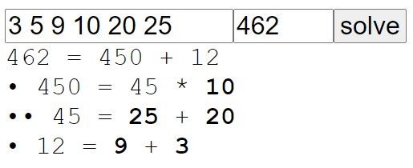

[Try it!](https://christernilsson.github.io/2023-020-NYT-Digits)

https://www.nytimes.com/games/digits

https://www.youtube.com/watch?v=WslHCziT4xM

# Method

* Iterative deepening search.
* The solution found, will be the shortest
* Maximum six numbers.

* original numbers are bold
* intermediate numbers are normal
* indentation shows dependence
* start from the bottom